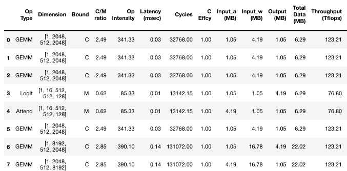
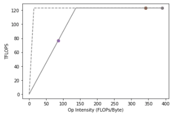

# Roofline Model for DNN Workload and Accelerator 
This is a roofline cost model for DNN accelerators. We support CNNs, MLPs, and Transformers workload.

# What it does
* Given DNN accelerator system information (using the `System` class in `src/system.py`), where you can specify PE array shape (mxu_shape), on-chip BWs, off-chip BWs, etcs.
* Given DNN workload (e.g., `model='vgg16'`)

RAGS (using `get_model_df()`) generate a table of layer-wise latency and memory usage information as well as a roofline figure, as shown in the following

# How to use it
Please take a look at the simple example in`notebook/plot_roofline.ipynb`.